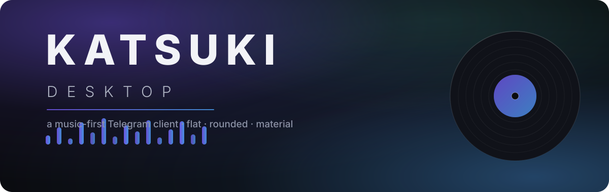
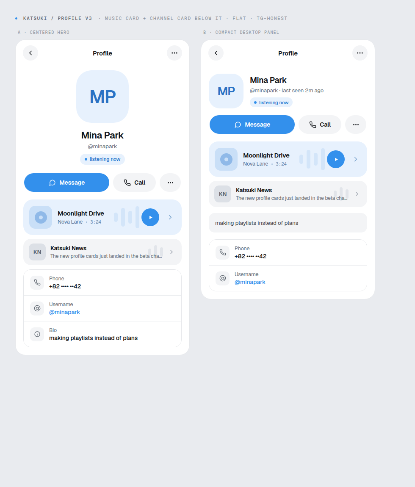

<div align="center">



<br/>

[](https://github.com/haerin-tg/katsuki-desktop/actions/workflows/linux.yml)
[](LICENSE)
[](#-building)
[](#-roadmap)
[](https://github.com/telegramdesktop/tdesktop)

**A Telegram Desktop client where your profile is a listening room.** 💿

*勝 — "victory". Flat surfaces, round shapes, one accent color, real Material 3 player.*

</div>

---



---

## 💢 Why another Telegram client?

Every fork reskins the same thing. Katsuki rebuilds the parts that say something about you — around **music** — while keeping the look **flat and Telegram-honest**: solid fills, RabbitGram-style rounding, Geist type. No glassmorphism. Ever.

### 1 · Profile, honest and new

A profile shows a *person*, not a library. Rounded-square avatar, name, handle, a quiet **"listening now"** pill, pill action row, and clean rounded info rows — familiar bones, brand-new composition.

### 2 · The song card

No tiny name/artist pill. The profile carries **one designed card**: cover thumbnail + title + artist inside a wide rounded pill with a flat, single-hue background design. Clicking it opens the whole playlist.

### 3 · The playlist sheet

Click the song → the playlist reveals: album art, `24 tracks · 1h 32m`, **Play all**, and a numbered track list with the playing row highlighted. Flat sheet, big rounding.

### 4 · A real Material 3 player

Not "round corners = MD3". The player uses the actual MD3 system: type scale (headline-small title), the 4px/20px MD3 slider, segmented repeat modes, assist chip for output device, circular FAB + tonal icon buttons, MD3 list items — plus a mini player bar.

---

## 🎨 Design system

**Flat. Round. Honest.** Full spec in [`design.md`](design.md) · engineering notes in [`raw.md`](raw.md) · mockups in [`docs/design-mockups/`](docs/design-mockups).

| Token | Value | Role |
|---|---|---|
| Base | `#FFFFFF` / canvas `#E9EBEF` | flat surfaces |
| Accent | `#3390EC` | the only color |
| Accent tints | `#E7F1FD` / `#D3E5F9` | card backgrounds, chips |
| Text | `#111418` / `#656D76` | one dark, one gray |
| Radius | 14 / 18 / 24 / 28 / pill | everything round |
| Type | Geist + Geist Mono | Vercel's type system |
| Player | Material 3 shape + type scale | MD3 done properly |


---

## 🗺️ Roadmap

- [x] Design direction locked — flat / rounded / MD3 / Geist
- [x] Profile mockups (A centered · B compact), song cards, playlist sheet, MD3 player
- [x] Phase 0 — repo, CI, provenance
- [x] Phase 1 — design tokens + waveform scrubber widget (needs v2 token rework)
- [ ] Theme system in `style/` + `lib_ui` with the v2 tokens
- [ ] Profile UI in tdesktop (`astra/profile`)
- [ ] Song card + playlist sheet
- [ ] MD3 player + mini player
- [ ] Polish: dark theme, hover states, reduced-motion, RTL

---

## 🛠️ Building

Built on the [Telegram Desktop](https://github.com/telegramdesktop/tdesktop) codebase (~10M lines of C++/Qt). CI does the heavy lifting; local builds need the usual tdesktop toolchain (Qt 6, CMake, Ninja, C++20).

```bash
git clone https://github.com/haerin-tg/katsuki-desktop.git
cd katsuki-desktop
# set your API credentials (see below), then the standard tdesktop CMake flow
```

**API credentials:** Telegram requires every client to have its own `api_id` / `api_hash` — get them free at [my.telegram.org](https://my.telegram.org) (*API development tools*). Development builds use tdesktop's public **test credentials** (`TDESKTOP_API_TEST=ON`); release builds need your real keys as CI secrets.

> ⚠️ **Heads-up:** third-party clients carry account risk. Use a test account while tinkering, and don't do anything against the Telegram ToS.

---

## 🙏 Credits

- **[Telegram Desktop](https://github.com/telegramdesktop/tdesktop)** — the codebase this all stands on. Thank you.
- **[AyuGram](https://github.com/AyuGram/AyuGramDesktop)** & friends — proof that a fork can have a soul
- **[RabbitGram](https://github.com/rabbitgram)** — the rounding inspiration
- **[Geist](https://vercel.com/font)** by Vercel — the type system
- **[Material Design 3](https://m3.material.io)** — the player's component vocabulary

---

## 📜 License

[GPL-3.0](LICENSE) — same as Telegram Desktop. Keep the license and copyright notices, and you're golden.

*Not affiliated with Telegram Messenger Inc. "Telegram" is a trademark of Telegram Messenger Inc.*
